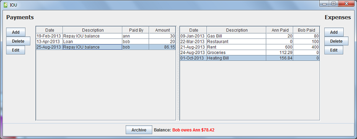
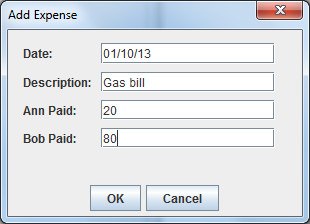
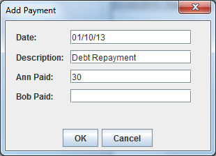

## What is IOU?
A desktop application that helps two people keep track of money owed to each other. It would typically be
useful to a couple, roommates, or any two people that incur shared expenses and/or lend money to each other. IOU
keeps a record of all transactions and calculates the current balance (shown in red below).



## How does it work?
IOU supports two types of transactions: payments and expenses.

### Expenses
Shared expenses are recorded in the right-hand table. It is assumed that all shared expenses should be
split 50/50. For example, if Ann and Bob have a current balance of $0 (neither owes the other anything), then they
receive a gas bill for $100 of which Ann pays $20 and Bob pays $80. This expense should be entered like so:



After this expense is saved, the current balance will indicate that Ann owes Bob $30.

### Payments

A payment occurs when one party gives money directly to the other. Typically, a payment will either be a loan or repayment
of an outstanding debt. For example, following payment of the gas bill mentioned above, Ann owes Bob $30. Ann repays this
debt by giving Bob $30. This should be entered as a payment like so:



After this payment is saved, the current balance will indicate that neither Ann nor Bob owes the other anything.

### Archive

By default, all payments and expenses entered since the beginning of time are displayed by IOU. When an archive
is performed all payments and expenses that were entered prior to the archive are permanently hidden, but the current
balance is carried forward. In other words, an archive clears the list of payments and expenses shown in IOU without
affecting the current balance.

## Installation

### Prerequisites
If using macOS or Linux it is recommended to use either [Homebrew](https://brew.sh/) or [SDKMAN](https://sdkman.io/) 
to install the following dependencies.

* Java, version 17 and above.
  * [Running the application from source](#source) requires a full Java Development Kit (JDK)
  * [Running the executable JAR](#binary) requires only a Java Runtime Environment (JRE)
* MySQL, version 8 and above
* Maven, version 3

### Configuration

The steps below only need to be performed once, before you run the application for the first time:

* Create a MySQL database named `iou`. If the MySQL server is not running on the default port (3306) on localhost
(or you didn't name the database `iou`), make the appropriate changes to the `jdbc.url` config parameter in `resources/config.properties`
* Create the database table and triggers via the SQL script `src/main/resources/schema.sql`
* Create two MySQL users that have read-write access to the `iou` database
* In `config.properties` set `ann.username` to the MySQL login of one of the users and set `bob.username` to the
MySQL login of the other user
* In the same file, set `ann.name` and `bob.name` to the names that IOU will display for each of these users
* If $ is not used as the currency symbol in your locale, also set `currency.symbol` to whatever you wish to use instead 

#### Database Initialization Example

Assuming the following:
* We are using the default database name "iou"
* We are using the default names for both MySQL users ("ann" and "bob")
* Both database users are using the password "secret"
* The current directory is set to the root of this project

The database initialization steps described in the previous section can be performed
by logging into MySQL as the root user and executing the following commands

```
mysql> create database iou;
mysql> use iou;
mysql> source src/main/resources/schema.sql
mysql> create user ann@localhost identified by 'secret';
mysql> grant all on iou.* to ann@localhost;
mysql> create user bob@localhost identified by 'secret';
mysql> grant all on iou.* to bob@localhost;
```

### Run IOU

#### Binary
Download `iou.jar` from [the releases](https://github.com/donalmurtagh/iou/releases) and launch it with
```
java -jar iou.jar
```
When the application starts, the selected user should use their MySQL password to login.

#### Source
To build and run the application from source with Maven, execute the command below from the project's root directory:
```
mvn compile exec:java -Dexec.mainClass=iou.gui.AppLauncher
```
When the application starts, the selected user should use their MySQL password to login.
